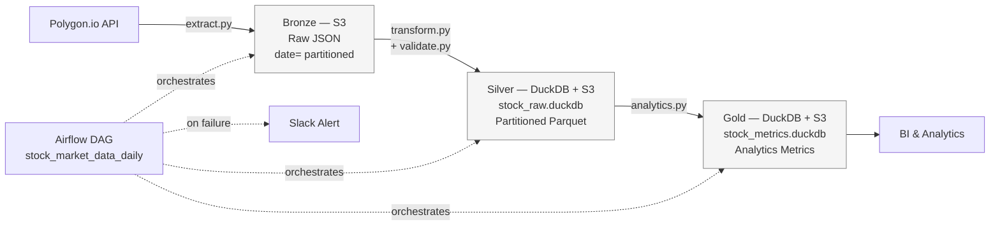

# Cloud-Native Stock Market ETL Pipeline

A professional-grade data engineering pipeline designed to ingest, process, and analyze stock market data. This project implements a Medallion Architecture to move data from raw ingestion to analytics-ready datasets, utilizing a cloud-first approach with AWS S3, embedded DuckDB analytical stores, Apache Airflow orchestration, and Terraform-managed infrastructure.

## 📚 Additional Documentation

This repository includes supplementary engineering documentation describing how the pipeline evolved over time and the reasoning behind key architectural decisions.

- **[Architecture Evolution & Design Decisions](Architecture_Evolution_And_Design_Decisions.md)** — Documents the major architectural milestones, trade-offs, and rationale behind each iteration of the pipeline, from local scripts to a cloud-native, Airflow-orchestrated, Terraform-managed data platform.

## 🚀 Project Overview
This pipeline demonstrates a production-ready approach to ETL/ELT, moving data from the Polygon.io API into a structured, reliable format.

* **Bronze**: Raw, immutable JSON responses from the Polygon.io API, stored in AWS S3 with date-based partitioning.
* **Silver**: Data cleaned, schema-validated, and incrementally upserted into an embedded DuckDB analytical store (`stock_raw.duckdb`) for relational processing. Partitioned Parquet datasets are persisted to AWS S3 as the durable analytical storage layer.
* **Gold**: Business-ready metrics — daily returns and intraday volatility — calculated and incrementally upserted into a second DuckDB analytical store (`stock_metrics.duckdb`) and persisted to S3 for reporting and analysis.

## 🛠 Tech Stack
| Category | Technology |
| :--- | :--- |
| **Language** | Python |
| **Cloud Storage** | AWS S3 |
| **Processing & Analytics** | DuckDB |
| **Data Format** | JSON, Parquet |
| **Data Analysis** | Pandas |
| **Orchestration** | Apache Airflow (via Astro CLI) |
| **Infrastructure as Code** | Terraform |
| **Data Source** | Polygon.io API |

## 🏗 Pipeline Architecture



Each stage independently checks whether its own S3 output already exists before running (idempotency gates), so re-running a date that's already fully processed is a fast no-op, and a partially-completed run (e.g. Bronze exists but Gold was deleted) self-heals on the next run.

## 🪁 Orchestration
The pipeline runs as an Airflow DAG (`stock_market_data_daily`), scheduled Tuesday–Saturday to capture the previous trading day's data:

1. **`check_market_calendar`** — gatekeeper task using `pandas_market_calendars` (NYSE) to confirm the target date was a trading day. If the market was closed, this task raises `AirflowSkipException`, and all downstream tasks are automatically skipped rather than running as a no-op — so DAG run history accurately reflects which days processed real data.
2. **`run_extraction`** → **`run_transformation`** → **`run_analytics`** — chained tasks calling `fetch_stock_data`, `transform_bronze_to_silver`, and `generate_gold_metrics` respectively, passing S3 keys (not local file paths) between tasks so each stage is safely retryable regardless of which worker executes it.

Each stage independently checks whether **its own** output already exists in S3 before doing any work (unless `force_overwrite` is set). This means a partially-completed run — e.g. Bronze and Silver already exist but Gold was manually deleted — self-heals on the next run without any special-casing: each stage only asks "does my output exist?", not "did the pipeline already run?"

To force a specific historical date to re-run, use Airflow's **Trigger DAG w/ config** and set the logical date to one day after the trading date you want (the DAG subtracts a day to capture the previous session's data) — no code changes or hardcoded dates required.

`max_active_runs=1` ensures only one DAG run executes at a time, since Bronze/Silver/Gold stages upsert into shared, persistent DuckDB files in S3.

Run locally with the Astro CLI:
```bash
astro dev start
```

A standalone `main.py` entrypoint is also included for running the full pipeline outside of Airflow (e.g. local testing, ad-hoc backfills).

## 🧱 Infrastructure as Code (Terraform)
The project's AWS S3 bucket is managed via Terraform, under the `terraform/` directory:

| File | Purpose |
| :--- | :--- |
| `providers.tf` | Configures the AWS provider and required Terraform version. |
| `variables.tf` | Declares the `bucket_name` input variable. |
| `main.tf` | Defines the `aws_s3_bucket` resource (with standard tagging) and an `aws_s3_bucket_public_access_block` resource enforcing that the bucket is never publicly accessible. |
| `outputs.tf` | Exposes the bucket's ARN and name as Terraform outputs. |
| `terraform.tfvars.example` | Template for the (gitignored) `terraform.tfvars` file that supplies the real bucket name locally. |

Since the S3 bucket already existed (created via `boto3` before Terraform was introduced), it was brought under Terraform's management with `terraform import` rather than recreated — adopting existing infrastructure without downtime or data loss. This also surfaced the exact minimal set of IAM permissions Terraform needs beyond what the pipeline itself uses (e.g. `s3:GetBucketPolicy`, `s3:PutBucketTagging`), which were added to the pipeline's IAM user as a scoped, bucket-specific policy rather than a broad managed policy like `AmazonS3FullAccess`.

Running `terraform plan` now serves as a standing drift check — confirming the bucket's real-world configuration (tags, public access settings) still matches what's declared in code.

## ⚙️ Configuration
Set the following environment variables (GitHub/Astro secrets or a local `.env`):

| Variable | Description |
| :--- | :--- |
| `AWS_ACCESS_KEY_ID` | AWS credentials |
| `AWS_SECRET_ACCESS_KEY` | AWS credentials |
| `AWS_BUCKET` | Shared S3 bucket for Bronze/Silver/Gold data and DuckDB warehouse backups |
| `POLYGON_API_KEY` | Polygon.io API key |

> Postgres has been fully retired from this pipeline — DuckDB now serves as the embedded analytical engine for Silver and Gold processing, with S3 Parquet datasets providing durable cloud storage.

## 📊 Local Data Warehousing with DuckDB
The pipeline uses lightweight, embedded DuckDB analytical stores for fast OLAP processing and relational upserts, with database files persisted to S3 between runs.
* **`stock_raw.duckdb`** — cleaned raw stock quotes (Silver layer), keyed on `(ticker, trading_date)`.
* **`stock_metrics.duckdb`** — calculated financial metrics (Gold layer), keyed on `(ticker, trading_date)`.

Each run downloads the current DuckDB database file from S3 (if it exists), performs incremental upserts, and uploads the updated database back to S3, allowing state to accumulate across runs rather than starting from scratch.

## 📈 Scaling Considerations
The current design (10 tickers, 1 API, daily batch) is intentionally simple, but every component has a known breaking point. Here's how each layer would need to evolve at greater scale, and why:

### Data Volume: 10 tickers → thousands
- **Current**: `TICKERS` is a hardcoded Python list of 10 symbols, looped synchronously with a 1-second delay between calls.
- **Breaking point**: At ~5,000 tickers with a 1-second-per-call floor, a single day's extraction alone would take over an hour — before accounting for rate-limit backoff. This doesn't scale linearly with ticker count in a way that fits a short daily batch window.
- **Next step**: Move from a hardcoded list to a ticker universe stored in S3/a database, and parallelize extraction with `asyncio`/`aiohttp` or a worker pool, respecting the API's actual rate limit (requests/second) rather than a flat per-call sleep. Airflow's dynamic task mapping (`.expand()`) is a natural fit here — one mapped task instance per ticker or per batch of tickers, each independently retryable.

### API Constraints
- **Current**: All-or-nothing per run — a single failed ticker aborts the whole extraction (a deliberate tradeoff made early on, to ensure each Bronze partition represents a complete daily extraction).
- **At scale**: With thousands of tickers, one bad symbol shouldn't sink the whole batch. The tradeoff would flip: partial extraction (log and skip failed tickers, alert on the failure rate) becomes the right default, with the validation gate (`validate_bronze_data`) doing the job of catching whether the *shortfall* is acceptable, rather than a single ticker doing it.
- **Next step**: Track a per-run success/failure ratio and fail the pipeline only if that ratio crosses a threshold (e.g. >5% of tickers failed), rather than on any single failure.

### Storage & Compute: DuckDB-in-S3 → a real warehouse
- **Current**: Each run downloads a full DuckDB file from S3, upserts locally, and re-uploads the whole file. This works well at the current scale (single-digit MBs) because DuckDB is fast and the file is small enough to move over the network cheaply on every run.
- **Breaking point**: This pattern doesn't scale with database size — a multi-GB DuckDB file downloaded and re-uploaded on every single run (even for one day's worth of upserts) becomes slow and expensive, and creates exactly the concurrent-write risk `max_active_runs=1` currently guards against by brute force (serializing all runs).
- **Next step**: Migrate to a warehouse designed for concurrent, incremental writes — Snowflake, BigQuery, or Athena directly over the Silver/Gold Parquet files in S3 (using Hive-style `date=` partitioning, which the project already uses). This removes the "download the whole database file" bottleneck entirely and unlocks genuinely concurrent runs instead of serializing everything through `max_active_runs=1`.

### Orchestration & Reliability
- **Current**: A single linear DAG (`extract → transform → analytics`), one run per weekday, `max_active_runs=1`.
- **At scale**: A single serialized DAG run won't parallelize across thousands of tickers or multiple markets/asset classes. Backfills (like the one used to fill in early July's missing dates) would also take proportionally longer under full serialization.
- **Next step**: Dynamic task mapping for per-ticker (or per-batch) parallelism within a run; separate DAGs per asset class or exchange if the data sources diverge; and moving from "one big DuckDB file" concurrency-by-serialization to a warehouse that supports real concurrent writes (see above), which would allow more flexible concurrency controls than the current serialized DuckDB approach.

## 🚀 Future Roadmap
- [ ] **Scalability**: Dynamic task mapping in Airflow for per-ticker parallelism; migrate warehousing off single-file DuckDB to Snowflake/BigQuery/Athena (see [Scaling Considerations](#-scaling-considerations)).
- [x] **Observability**: Failure alerting via Airflow's `on_failure_callback` (Slack).
- [ ] **Data Quality**: Integrate Great Expectations for automated testing, with results logged to a queryable table rather than pass/fail only.
- [x] **Infrastructure**: Use Terraform to manage cloud resources (IaC) — S3 bucket now under Terraform management via `terraform import`.
- [ ] **Infrastructure (next)**: Extend Terraform to manage the pipeline's IAM policy itself, scoping it to least-privilege as code rather than via manual console edits.
- [ ] **Lakehouse Format**: Evaluate Delta Lake or Apache Iceberg to add transactional table management, schema evolution, and time-travel capabilities on top of S3 Parquet storage.

## 📦 How to Run
1. **Clone the repository**:
   ```bash
   git clone https://github.com/devhongskim/stock-data-pipeline.git
   ```
2. **Install dependencies**:
   ```bash
   pip install -r requirements.txt
   ```
3. **Configure environment**: Create a `.env` file with your API keys and AWS credentials.
4. **Execute** (standalone):
   ```bash
   python main.py
   ```
   Or run the full pipeline via Airflow using the Astro CLI (`astro dev start`).
5. **(Optional) Provision/adopt infrastructure via Terraform**:
   ```bash
   cd terraform
   cp terraform.tfvars.example terraform.tfvars   # fill in your real bucket name
   terraform init
   terraform plan
   terraform apply
   ```

### Storage Strategy
The Bronze layer utilizes date-based partitioning to optimize data retrieval and organization.


### Gold Layer: Analytics-Ready Data
The pipeline calculates key financial metrics, including daily returns and intraday volatility, which are upserted into the DuckDB Gold analytical store and persisted to S3 for reporting and analysis.
